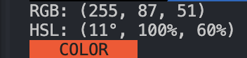

# rgb-to-hsl-cli

**rgb-to-hsl-cli** is a CLI tool that converts rgb to hsl.


## Quick Start

Get **rgb-to-hsl-cli** up and running quickly!

1. **Run**:
    ```bash
    npx rgb-to-hsl-cli 255 129 110
    ```
2. **Done!**

### Example Output

This will convert the RGB values `(255, 129, 110)` to its HSL equivalent, and display a color preview in your terminal.

- **Input**: `255 129 110`
- **Output**: `HSL: (14°, 100%, 60%)`
- **Color Preview**: `COLOR PREVIEW (in the specified color)`



## Contributing

We welcome contributions to **rgb-to-hsl-cli**! Whether it's reporting a bug, suggesting an enhancement, or submitting a pull request, your input is valued.

## License

This project is licensed under the MIT License - see the [LICENSE](LICENSE) file for details.

## Contact

For any questions, suggestions, or feedback, please contact [love1ace](mailto:lovelacedud@gmail.com).